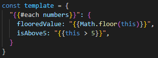
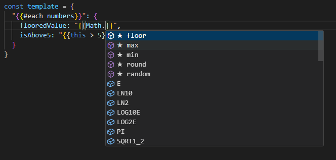
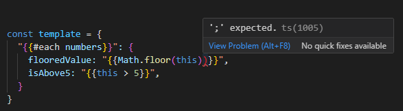
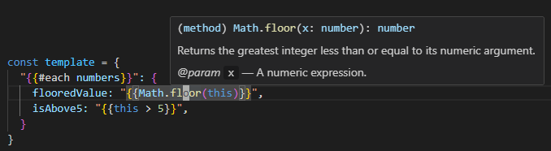

# Select Transform for VSCode

This extension adds support for select transform templates to VsCode.

## Features
### Syntax highlighting
The contents of Select Transform strings are highlighted as if they were regular JavaScript.

### Auto complete
Gives the same auto complete that is provided for regular JavaScript files.

### Diagnostics
Provides full diagnostics to catch syntactical errors in the Select Transform strings before it is run.

### Hover support
Hovering over variables and functions will show the type or function declaration like in a regular JavaScript file.

## Limitations
This extension does not implement a LSP Server for Select Transform strings meaning that there is some limitations as to what can be done.
Most notably when using the extension there will be a temporary JavaScript file open to be able to get diagnostics for the JavaScript templates.
